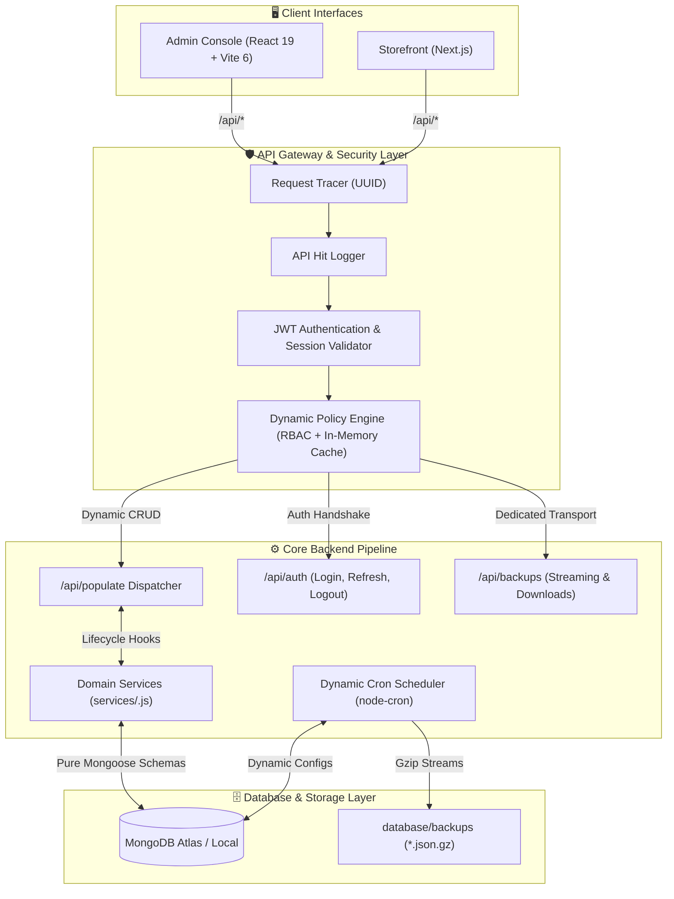
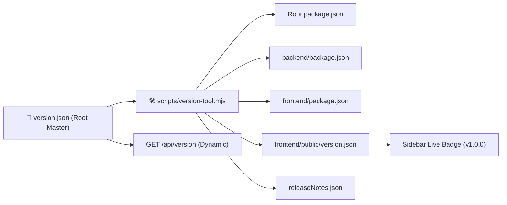

<div align="center">

```
   █████╗ ██╗   ██╗██╗███╗   ██╗██╗██╗  ██╗
  ██╔══██╗╚██╗ ██╔╝██║████╗  ██║██║╚██╗██╔╝
  ███████║ ╚████╔╝ ██║██╔██╗ ██║██║ ╚███╔╝ 
  ██╔══██║ ██╔═██╗ ██║██║╚██╗██║██║ ██╔██╗ 
  ██║  ██║██╔╝ ██╗ ██║██║ ╚████║██║██╔╝ ██╗
  ╚═╝  ╚═╝╚═╝  ╚═╝╚═╝╚═╝  ╚═══╝╚═╝╚═╝  ╚═╝
   T   E   C   H   N   O   L   O   G   I   E   S
```

# ⚡ Axinix E-Commerce - An Omnichannel Inventory & Billing Platform
### *An Axinix Technologies Product • "Build Next Gen Today"*

---

[](./version.json)
[](./knowledge_brain/ARCHITECTURE.md)
[](https://nodejs.org/)
[](https://react.dev/)
[](https://tailwindcss.com/)
[](https://vitejs.dev/)
[](https://www.mongodb.com/)

<br />

[Explore Documentation](./knowledge_brain/INDEX.md) • [Architecture Guide](./knowledge_brain/ARCHITECTURE.md) • [Developer Guide](#-developer-guide) • [API Reference](#-api-architecture--endpoints) • [Version Tooling](#-version-management-cli)

---

</div>

<br />

## 🌟 Executive Summary

The **Centralized E-Commerce Platform** is an enterprise monorepo engineered by **Axinix Technologies** under our foundational motto: *"Build Next Gen Today"*.

Originally tailored for a leading manufacturer & brand in **Baby & Ladies Products** (Apparel, Accessories, Health & Personal Care), the platform delivers:
- **Cloud POS & Billing System**: Rapid retail counter billing, barcoding, and automated multi-tax invoice computation.
- **Centralized E-Commerce Storefront**: Modern customer-facing online shop with dynamic catalogs and checkout.
- **Omnichannel Stock & Order Ledger**: Real-time bidirectional connectivity to **Amazon** and **Flipkart** platforms, automatically syncing stock reservations and fulfilling marketplace orders to prevent overselling.
- **Tracker-v2 Dynamic Architecture**: Built with a pure populate-helper paradigm, automated Gzip streaming database backups, and single-source semver version governance.

---

## 🏗️ System Architecture & Data Flow



---

## 💎 Core Architecture Pillars

### 1. Centralized Single-Source Versioning
> [!TIP]
> Versioning is mastered exclusively in [`version.json`](./version.json) at the root. Sub-projects never diverge in version.



### 2. Populate-Helper First (Architecture Rule #8)
> [!IMPORTANT]
> **Strict Rule on Routers & Controllers**: Having custom business logic is **never** a reason to create a new controller or router. All business logic belongs in the domain service (`services/<model>.js`), executed seamlessly within the `/api/populate` request lifecycle.
>
> Dedicated controllers or routers are **STRICTLY PROHIBITED** unless:
> 1. The transport cannot physically be handled via `populateHelper` (e.g. streaming binary `.json.gz` file downloads).
> 2. There is a verified, critical performance bottleneck.
>
> **Automatic Inherited Protections:**
> - 🛡️ **RBAC & Field Projection**: Predefined access policies (`access_policies`) filter forbidden fields per role.
> - 🧼 **Data Sanitization**: Automatic recursive trimming, HTML strip, and schema typing.
> - ⚡ **Safe Aggregation**: Automatic safeguards against denial-of-service stage injections.
> - 🔍 **Request Tracing**: End-to-end correlation IDs stamped on every lifecycle event.

### 3. Pure Schemas & Dynamic Model Registry
Every model in [`backend/src/models/`](./backend/src/models/) is a 100% pure Mongoose schema containing zero business logic. Models are registered in a single central dictionary [`Collection.js`](./backend/src/models/Collection.js) for dynamic lookup.

### 4. Pure Page-Only Frontend Routing
Frontend routing follows a strict layout-view separation via `vite-plugin-pages` (`~react-pages`). Only routed page views live in `frontend/src/pages/`. All UI widgets, navigation panels, and contextual state providers are strictly isolated in `components/`, `layouts/`, and `context/`.

---

## 📦 Monorepo Directory Layout

```text
E-commerce/
├── 📄 version.json                   # 👑 Single Source of Truth Project Version
├── 📄 package.json                  # 🛠️ Monorepo workspace commands
├── 📁 .agents/                      # 🤖 Governance directives & Rule #8
├── 📁 Docs/                         # 📑 Product requirement & architectural docs
├── 📁 knowledge_brain/              # 🧠 Living knowledge catalog (Alphabetical)
│   ├── ACCESS_POLICIES.md           # Dynamic RBAC model & resolution
│   ├── ARCHITECTURE.md              # Dispatcher pattern & Rule #8
│   ├── AUTHENTICATION.md            # JWT lifecycle & session store
│   ├── BACKUP_AND_CRON_SYSTEM.md    # Streaming Gzip backup engine
│   ├── FRONTEND_ARCHITECTURE.md     # Vite 6, Tailwind v4, ~react-pages
│   ├── GENERAL_SETTINGS.md          # Centralized store configuration
│   ├── INDEX.md                     # Master alphabetical catalog
│   ├── POLICY_ENGINE.md             # In-memory policy cache engine
│   └── VERSIONING.md                # Single-source versioning system
├── 📁 backend/                      # 🚀 Express REST API Engine
│   ├── src/
│   │   ├── Config/                  # Database connections (ConnectDB.js)
│   │   ├── Controller/              # Dedicated controllers (Auth, Backup)
│   │   ├── crud/                    # Dynamic CRUD query generator
│   │   ├── helper/                  # populateHelper pipeline
│   │   ├── middlewares/             # Policy engine, tracer, hit logger
│   │   ├── models/                  # Pure schemas (Collection.js dictionary)
│   │   ├── routes/                  # API routes (auth, populate, backups)
│   │   ├── scripts/                 # Database seeders (seedSuperAdmin.js)
│   │   ├── services/                # Model hooks, backup engine, scheduler
│   │   └── utils/                   # Cache, crypto, formatters
│   ├── package.json
│   └── server.js
├── 📁 frontend/                     # 🎨 React 19 Admin Operations Console
│   ├── public/                      # Static assets & public/version.json
│   ├── src/
│   │   ├── api/                     # Preconfigured Axios & populate client
│   │   ├── components/              # Sidebar (with live version badge), TopNavBar
│   │   ├── context/                 # AuthProvider, ThemeProvider (Dark/Light)
│   │   ├── layouts/                 # BaseLayout responsive frame
│   │   └── pages/                   # Strict file-based page views (~react-pages)
│   ├── package.json
│   └── vite.config.js
├── 📁 database/                     # 💾 Seeders, DB scripts & Gzip archives
│   └── backups/                     # Auto-pruned .json.gz backups
└── 📁 scripts/                      # ⚙️ CI/CD & Versioning automation
    ├── version-tool.mjs             # Semver bump & multi-project sync
    └── verify-deploy-version.mjs    # Pre-deployment version gate
```

---

## 🛠️ Developer Guide

This guide is for internal team developers contributing to the Centralized E-commerce Platform.

### 1. Local Development Workflow

#### Prerequisites
- **Node.js**: `v18.0.0+` (LTS recommended)
- **MongoDB**: Active instance (local `mongodb://127.0.0.1:27017` or Atlas cluster)
- **npm**: `v9+`

#### Backend Service Setup
```bash
cd backend
npm install

# Copy environment configuration
cp .env.example .env

# Populate local database with seed data, policies, roles, and default Super Admin
npm run seed

# Run backend with nodemon hot-reloading
npm run dev
```
> [!NOTE]
> Backend server boots on `http://localhost:5000`. The initialization routine (`initApp`) verifies MongoDB connectivity, pre-warms the policy engine in-memory cache (`setCache`), and synchronizes dynamic `node-cron` backup tasks from the database.

#### Frontend Operations Console Setup
```bash
cd frontend
npm install

# Run Vite dev server with Hot Module Replacement (HMR)
npm run dev
```
> [!NOTE]
> Frontend launches at `http://localhost:5173`. Vite is preconfigured with an internal reverse-proxy routing all `/api` requests directly to `http://localhost:5000`.

---

### 2. Engineering Standards & Contribution Rules

All internal development must adhere to the following architectural invariants:

1. **Populate-Helper First (Architecture Rule)**:
   - **Do NOT create new Express routers or controllers for business logic.**
   - All CRUD operations, state transitions, validation checks, side-effects, and multi-collection aggregations must be implemented in the domain service (`backend/src/services/<model>.js`) hooked into `/api/populate`.
   - Dedicated controllers/routers are strictly prohibited unless the transport cannot physically be handled via populate (e.g. streaming binary file downloads) or represents a verified, critical performance bottleneck.
2. **Pure Schemas in `models/`**:
   - Never add business logic, middleware hooks, or complex methods directly inside `backend/src/models/`.
   - Register all models in the central registry dictionary [`backend/src/models/Collection.js`](./backend/src/models/Collection.js).
3. **Pure Page-Only Routing in `frontend/src/pages/`**:
   - `frontend/src/pages/` must contain **only** top-level routed page views matched by `vite-plugin-pages` (`~react-pages`).
   - Shared components, dialogs, widgets, charts, and layout elements must go into `src/components/`, `src/layouts/`, or `src/context/`.

---

### 3. Verification & Quality Gates

Before committing changes or creating a pull request, run the following verification checks:

```bash
# 1. Validate Backend syntax
cd backend
npm run check
# (or from root: npm run check:backend)

# 2. Verify Frontend production bundle compilation
cd frontend
npm run build

# 3. Check deployment version gate (from repository root)
npm run verify:backend
npm run verify:frontend
```

---

## 🔑 Default Credentials & Seed State

When `npm run seed` executes, the following initial state is populated into MongoDB:

| Entity | Default Identifier | Access Level / Value | Purpose |
| :--- | :--- | :--- | :--- |
| **Super Admin** | `username: "admin"` | `Admin@123456` | Full platform access (bypasses policy engine) |
| **System Roles** | `Super Admin`, `Admin`, `Staff`, `Customer` | Predefined hierarchy | Role-based authorization |
| **Daily Backup** | `Daily Automated Backup` | `0 2 * * *` (2:00 AM daily) | 14-day retention, Gzip compressed |
| **Store Settings** | `platformName: "Central Platform"` | Currency: `USD ($)` | Global currency, branding, inventory alerts |

---

## 🔄 Version Management CLI

The repository features automated semantic version management:

```bash
# Display active platform version
npm run version:get

# Propagate version across root, backend, frontend, and releaseNotes
npm run version:sync

# Increment semantic versions (updates version.json + auto-syncs all targets)
npm run version:bump:patch    # 1.0.0 -> 1.0.1 (bug fixes & patches)
npm run version:bump:minor    # 1.0.0 -> 1.1.0 (backward-compatible features)
npm run version:bump:major    # 1.0.0 -> 2.0.0 (breaking changes)

# Pre-deploy verification gate (ensures deployment version > live instance)
npm run verify:backend
npm run verify:frontend
```

---

## 📡 API Architecture & Endpoints

<details>
<summary><b>1. System Health & Diagnostics</b> (Click to expand)</summary>

| Method | Endpoint | Description | Auth Required |
| :--- | :--- | :--- | :---: |
| `GET` | `/test` | Lightweight health check | ❌ |
| `GET` | `/api/version` | Dynamic system version, uptime, and timestamp | ❌ |

</details>

<details>
<summary><b>2. Authentication & Session Management</b> (Click to expand)</summary>

| Method | Endpoint | Description | Auth Required |
| :--- | :--- | :--- | :---: |
| `POST` | `/api/auth/login` | Authenticates with `username` and `password` | ❌ |
| `POST` | `/api/auth/refresh-token` | Rotates access token via refresh token | ❌ |
| `POST` | `/api/auth/logout` | Revokes session and deletes active tokens | ✅ |
| `GET` | `/api/auth/profile` | Fetches active user profile and roles | ✅ |

</details>

<details>
<summary><b>3. Dynamic Populate Pipeline (`/api/populate`)</b> (Click to expand)</summary>

All entity operations pass through the dynamic populate pipeline with automatic RBAC policy validation:

| Method | Endpoint | Action | Service Hooks Triggered |
| :--- | :--- | :--- | :--- |
| `POST` | `/api/populate/create/:model` | Creates document | `beforeCreate` ➔ `afterCreate` |
| `POST` | `/api/populate/read/:model` | Reads / queries / paginates | `beforeRead` ➔ `afterRead` |
| `POST` | `/api/populate/update/:model/:id` | Updates document | `beforeUpdate` ➔ `afterUpdate` |
| `POST` | `/api/populate/delete/:model/:id` | Deletes document | `beforeDelete` ➔ `afterDelete` |

</details>

<details>
<summary><b>4. Database-Backed Backup & Scheduler</b> (Click to expand)</summary>

| Method | Endpoint | Description | Auth Required |
| :--- | :--- | :--- | :---: |
| `GET` | `/api/backups/stats` | Aggregated storage usage and backup history | ✅ |
| `POST` | `/api/backups/trigger` | UI button to trigger an immediate manual backup | ✅ |
| `GET` | `/api/backups/download/:id` | Direct binary stream of compressed `.json.gz` file | ✅ |
| `POST` | `/api/backups/reload-schedules` | Re-syncs cron scheduler with database configurations | ✅ |
| `DELETE`| `/api/backups/:id` | Deletes backup record and unlinks file from disk | ✅ |

</details>

---

## 🧠 Living Knowledge Brain

The repository maintains a strictly alphabetized knowledge catalog in [`knowledge_brain/`](./knowledge_brain/INDEX.md):

| Document | Core Focus |
| :--- | :--- |
| 🛡️ [**ACCESS_POLICIES.md**](./knowledge_brain/ACCESS_POLICIES.md) | Dynamic database-driven access policy resolution and model schema. |
| 🏛️ [**ARCHITECTURE.md**](./knowledge_brain/ARCHITECTURE.md) | Dynamic dispatch pattern, centralized model dictionary, and Rule #8. |
| 🔐 [**AUTHENTICATION.md**](./knowledge_brain/AUTHENTICATION.md) | Username + password authentication flow, JWT tokens, and session management. |
| 💾 [**BACKUP_AND_CRON_SYSTEM.md**](./knowledge_brain/BACKUP_AND_CRON_SYSTEM.md) | Streaming Gzip backup engine, dynamic `node-cron` synchronization, and retention. |
| 🎨 [**FRONTEND_ARCHITECTURE.md**](./knowledge_brain/FRONTEND_ARCHITECTURE.md) | Vite 6, Tailwind CSS v4, file-based routing (`~react-pages`), and ThemeProvider. |
| ⚙️ [**GENERAL_SETTINGS.md**](./knowledge_brain/GENERAL_SETTINGS.md) | Centralized platform configuration schema, store branding, and inventory limits. |
| 🔍 [**POLICY_ENGINE.md**](./knowledge_brain/POLICY_ENGINE.md) | In-memory policy cache, Super Admin bypass, and dynamic CRUD resolution. |
| 🏷️ [**VERSIONING.md**](./knowledge_brain/VERSIONING.md) | Single-source versioning system, semver automation tool, and deployment gates. |

---

## 💻 Tech Stack Summary

<div align="center">

| Layer | Technologies |
| :--- | :--- |
| **Backend Core** | Express.js 4.21, Node.js 18+, Mongoose 8.10 |
| **Security & Auth** | JWT (jsonwebtoken 9.0), bcryptjs, cookie-parser |
| **Async & Jobs** | node-cron 4.6, zlib Streaming Gzip |
| **Frontend Framework** | React 19, React DOM 19, React Router DOM 7 |
| **Build & Styling** | Vite 6.2, Tailwind CSS v4, `@tailwindcss/vite` |
| **Routing Strategy** | `vite-plugin-pages` (`~react-pages`) |
| **UI & Icons** | Lucide React, Glassmorphism, Tailwind Transitions |
| **DevOps & Gates** | ES Module Scripts (`version-tool.mjs`, `verify-deploy-version.mjs`) |

</div>

---

<div align="center">

<sub>Built with precision and care by <b>Axinix Technologies</b>.</sub><br />
<b>"Build Next Gen Today"</b><br />
<sub>Founding Leadership: Arunbharathi (Founder) • Ajay • Boopalan • Siva • Guru • Karuppasamy</sub><br />
<sup>Confidential & Proprietary • 2026</sup>

</div>
